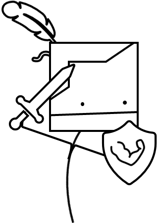
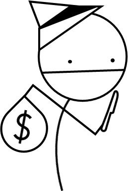
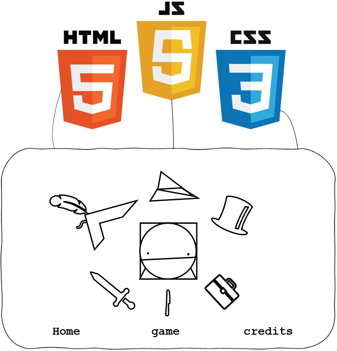
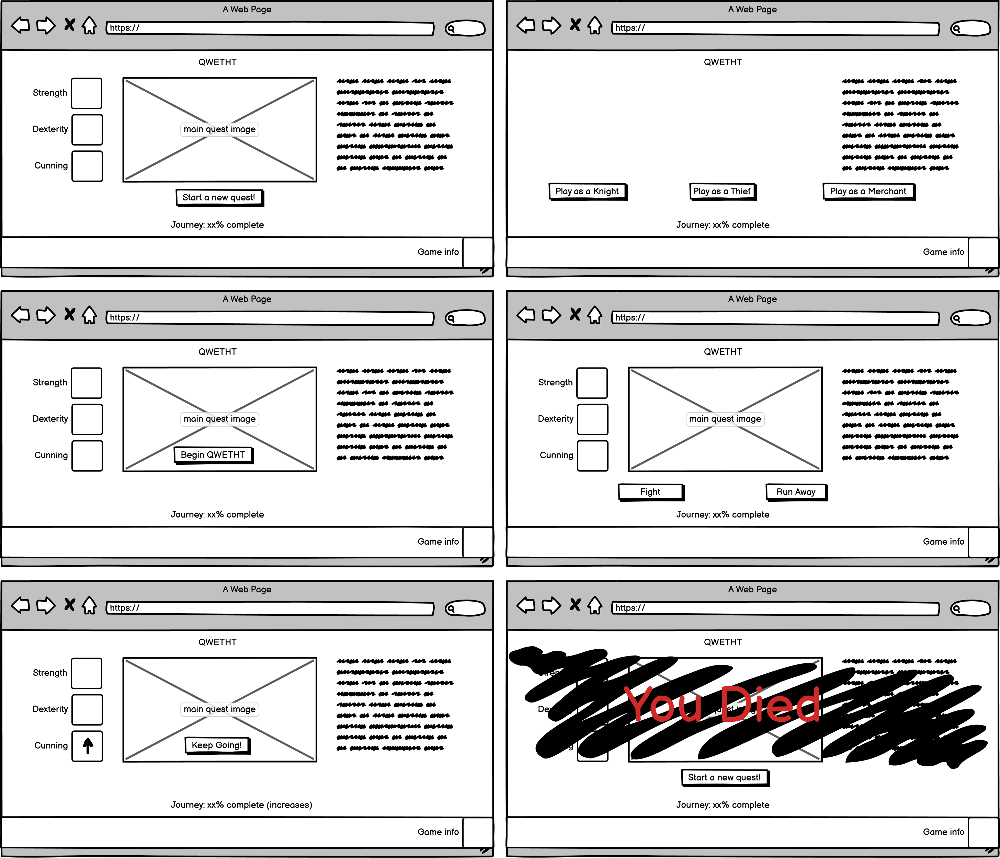
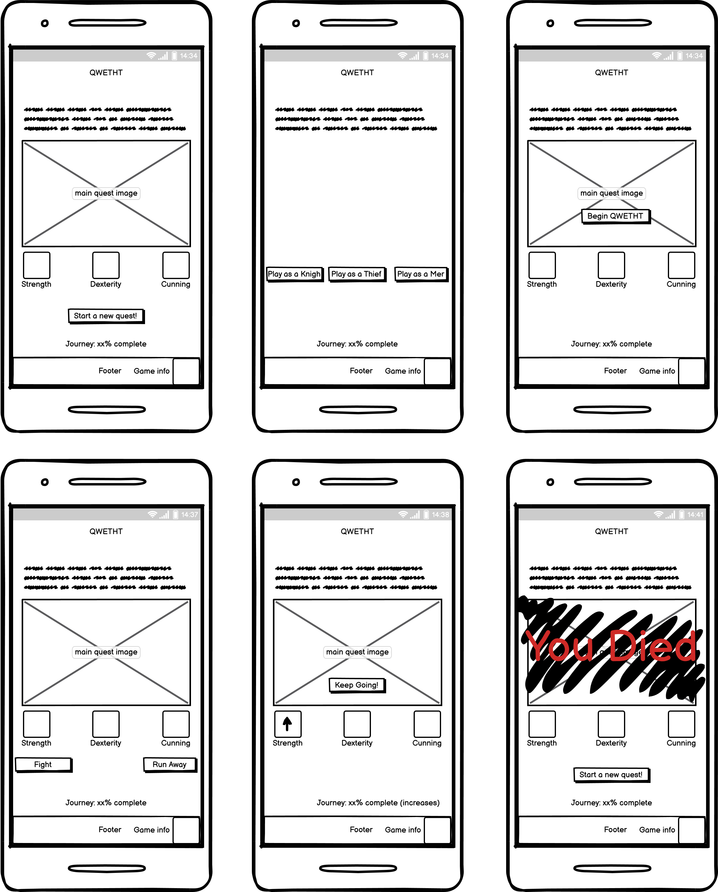

<h1 style="
text-align: Center; 
text-transform: uppercase; 
font-family: 'Courier New', Courier, monospace; 
letter-spacing: 3px;
font-weight: 700;
">
Qwetht
</h1>

### [AMIRESPONSIVE IMG TO GO HERE]

<h2 style="
text-align: center;
font-family: 'Courier New', Courier, monospace;
">
The Adventure generator beyond your wildest dreams, if your wildest dreams were created in MS paint.
</h2>

 

# Table of Contents
1. [Introduction](#introduction)  
2. [UX](#user-experience-ux)   
   i. Strategy Plane
   - User Stories
   - Online Research  
   - Project Goals
       - User Goals 
       - Developer Goals  
   - Strategy Table

   ii. [Scope Plane]()  
   iii. [Structure Plane]()  
   iv. [Skeleton Plane / Wireframes](h)  
   v. [Surface Plane / High Fidelity Mock Up]()  
   - [Color Scheme]()  
   - [Typography]()  
   - [Imagery]()  

3. [Features]()  
   i. [General Design Features]()  
   ii. [Page Design Features]()   
   iii. [Features to be Implemented in The Future]()

4. [Technology Used]()  
   i. [Main and Additional Languanges]()  
   ii. [Frameworks, Libraries, & Programs Used]()  

5. [Issues and Bugs]()  
   i. [Solved Issues]()  
   ii. [Known Issues & Unsolved Bugs]()  

6. [Deployment]()  
   i. [Deploy to Github]()  
   ii. [Forking to Github Repository]()  
   iii. [Making a Local Clone]()  

7. [Testing]()   
   i. [Go to TESTING.md]()  

8. [Credits](#credits)
- [Troubleshooting Sources](#troubleshooting-sources) 
   i. [Code]()  
   ii. [Images]()  
   iii. [Sound Effects]()  
   iii. [Contents]()   

9. [Acknowledgements]()

 

# Introduction

Qwetht is a randomly generated adventure game inspired by classic text-based Adventure games like [Colossal Cave Adventure](https://en.wikipedia.org/wiki/Colossal_Cave_Adventure), webcomics such as [Problem Sleuth](http://www.mspaintadventures.com/newindex.php?viewmap=4) by [MS Paint Adventures](http://www.mspaintadventures.com/newindex.php) and tabletop games such as [Munchkin](https://en.wikipedia.org/wiki/Munchkin_(card_game)). The Game allows a player to pick one of three classes:

| 
The Knight
 | 
The Thief
 | 
The Merchant
 |
| ---------- | --------- | ------------ |
|  |  |  |

Once the player chooses their class, they will then have a random character generated for them, in addition to an adventure, where they will be take on 10 random encounters in order to complete the game.
 
Much like the games it was inspired by, 
Qwetht is very much designed to be that of a [roguelike](https://en.wikipedia.org/wiki/Roguelike) game, where incorrect decisions or bad luck result in game over, and there is heavy emphasis on starting over fresh each time the game is played.

## This project is the second of the five projects to be created for the Diploma in Full Stack Software Development (Common Curriculum).

Project purpose: Presentation of interactive data

The aim of this project is to:
 - Build an interactive front-end website
 - The site in question should respond to user's actions, allowing users to interact with data
 - alter the way the site displays information to achieve a preferred user goal
 - The site should make use of HTML, CSS and Javascript to achieve the above aims

 

# User Experience (UX)

## <b>Strategy Plane</b>

## User Stories

### <b>First-time Players</b>
Play-testers were interviewed before playing the game to establish user stories:

1. <em>"As a first-time player, i want to be able to understand the game mechanics with little study. The game UI needs to be intuitive."</em>
2. <em>"As a first-time player, i want there to be a help or menu section that explains the finer intricacies of the game, with little-to-no redirection from the game."</em>
3. <em>"As a first-time player, i want to have the element of choice when starting a game."</em>
4. <em>"As a first time player, i want the game interface to be clear and consistent at each step of the core gameplay loop."</em>
5. <em>"As a first-time player, i want to be able to track my progress during a playthrough."</em>

### <b>Returning Players</b>
After Playtesting the game, players were interviewed to establish their user stories as users who had played the game previously:

1. <em>"As a returning player, I want to be able to pick up where i left off."</em>
2. <em>"As a returning player, I want to be able to see a record of my past completions."</em>

 

## Research

As Mentioned in the [Introduction](#introduction), the game is inspired by original text-based adventure games, table-top games, roguelike games and webcomics. styling inspiration and mechanic ideas where derived from viewing the following sources:
1. [MS Paint Adventures](http://www.mspaintadventures.com/newindex.php?viewpage=archive)
    - As this site is now pretty old, it appears the site archive has not been maintained. However, when this comic series was active, the author would create the next pane of each comic solely from the input provided by fans and its community. This resulted in an element of chaos and randomness which made the comic humorous and enjoyable.
    - with these elements in mind, peers were contacted for limitied input regarding encounters with no context, names, monsters and other aspects of the end product that are rendomly generated, to try and emulate a similar sense of chaos and randomness in this game.
    - Style for the project was inspired by the original design of these webcomics.

     

2. [Colossal Cave Adventure](https://www.microsoft.com/en-gb/p/colossal-cave-adventure/9wzdncrdlv4h?activetab=pivot:overviewtab)
    - The original test based game that proceduraly generates an adventure, offering users text to determine outcomes of scenarios.
    - This mechanic is adopted with the use of the information collected by peers to create the concept of a randomly generated adventure.

     

3. [Dark Souls](https://en.wikipedia.org/wiki/Dark_Souls)
    - This video game employs the use of player death as a direct mechanic of the core gameplay loop.
    - This idea was adopted for use within this game, given the game's small nature, and the limited timeframe to build. the routine death mechanic ensures for regular cycling of player type and encounter type.

     

4. [Munchkin](https://en.wikipedia.org/wiki/Munchkin_(card_game))
    - The aim of the game in Munchkin is for players to reach level 10 by "kicking in the door" on each turn as if they are progressig through a dungeon. the game employs simple math to determine if players succeed in an encounter, and if they do, gain and increased stat each level they complete.
    - The game also employs elements that encourage other players to either work together or sabotage each other to prevent victory.
    - Both of these concepts were utilised within the project. With the Idea that players must complete a journey (consisting of 10 stages, progress being represented in percentage) with a reward of an increase in player stats upon successful engagement in the randomly generated encounter. The game also employs a "run away" mechanic should a player not like their odds when presented with a given encounter, but can still be punished during the run away roll, much like the conflict that is presented when playing Munchkin.

     

5. [Dungeons & Dragons 5E](https://en.wikipedia.org/wiki/Dungeons_%26_Dragons) 
    - This table top game uses varying types of dice rolls to determine the outcome of adventures tailored to the players. 
    - "Dice rolls" were employed as the base mechanics in this project to determine encounters, names, monesters and so forth. As well as performing stat checks, similar tot he way they are carried out in a standard game of Dungeons & Dragons.

 

## Project Goals

The project goal is to create a simple adventure game that draws from text-based and procedural adventure games that provides light humour and a challenge balanced equally by luck and choice.

 

  ### <b>Player goals</b>
  Based on user stories, user goals are defined as:

   1. A simple and easy to follow game
   2. A game that strikes a balance between choice and luck
   3. A game that can track and acknowledge the achievements of players
   4. A game that easy to "pick up" and "put down" as appropriate for a user

  ### <b>Developer Goals</b>   
  Based on project research, project goals are defined as:

   1. Create a random and humerous adventure game
   2. Create a game that adopts roguelike concepts, treating player death as part of the integral gameplay loop
   3. Create a game that effectively functions as a mini solo-play table-top RPG

 

## Stretegy Table

## <b>Scope Plane</b>

Based on the results of the strategy plane the following features have been focused on to develop:
 1. Player jobs/classes
    - at the start of the game, the player will be given the choice of 3 classes, each leaning more favourably into one of the 3 stats used for the game.

     

 2. Text that generates per each choice and action taken by the user
    - The text will be the first element to be read after the page title, being a focal point of information for the user.
    - This same text field will update every time a user takes an action, prompting them of the outcome of their choices.

     

 3. A box or viewport that gives visual representation of the adventure
    - The box will be placed directly under the text, to give visualisation of the narrative generated.
    - It will contain a backdrop and also an image representative of the player character.
    - image representing player character will be different based on the class picked by the player.

     

 4. An element that highlights player progress
    - a progress bar or counter will be places under all the main game controls, which tracks the players progress/how many encounters they have completed.

     

 5. Viewable and upgradable player stats
    - player stats will display next or under the visualisation window, depending on viewport/device parameters.
    - the stats will upgrade automatically depending on successful choices made by the user.

      

 6. A Prompt that appears upon player death
    - This will mimic the style of the death message that appears when players would die in the game [Dark Souls](https://www.youtube.com/watch?v=-ZGlaAxB7nI).

     

 7. A prompt that appears upon completing the game
    - Adopt a similar style to the message that appears in Dark souls [when a player defeats a boss or lights a bonfire](https://youtube.com/shorts/CzY3jsotryg?feature=share) in order to keep in line with the game style.

     

 8. Options to take per encounter
    - Have clear buttons that outline player options that appear right below the encounter visualisation.

     

 9. a "new Game" button
    - Will appear when a user completes a game or dies, allowing more a more seamless replay and user experience. 

 

## <b>Structure Plane</b>
Given the simplistic nature of the game; and for it to be seemless, all elements will be housed on the one page.

 

## <b>Skeleton Plane</b>
Using the information this far, Wireframes were created using Balsamiq. Mock ups were created for both a mobile design and landscape design

from left to right (reading like a storyboard), each image displays the following:
 1. The view of the page upon initial loading
 2. After the player has clicked to begin
 3. Afer the player has selected their class and received their prologue
 4. When a player is met with an encounter
 5. View upon encounter success
 6. View on encounter failure
    
    a. Same style will be used when user completes game. but text will be altered to reflect completion

<h3 syle="text-align: center">Landscape/desktop view</h3>

 

<h3 syle="text-align: center">Portrait/mobile view</h3>

 

# Credits
## Troubleshooting sources
- [stack overflow](https://stackoverflow.com/)
- [Bobby Hadz](https://bobbyhadz.com/blog/javascript-change-style-of-all-elements-with-class)
- [w3schools](https://www.w3schools.com/js/default.asp)