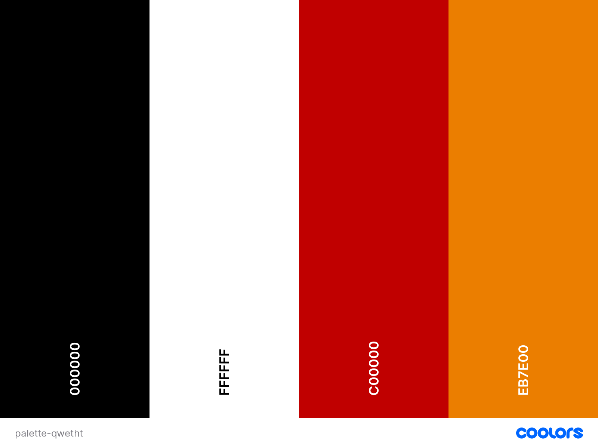
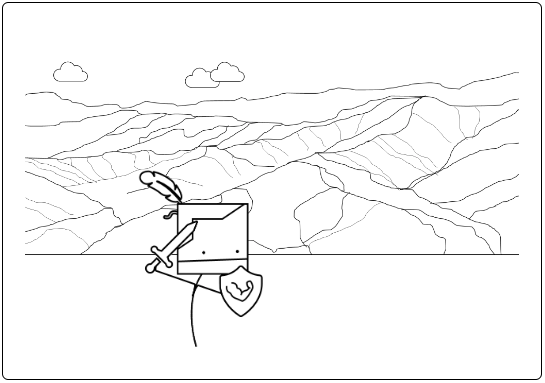
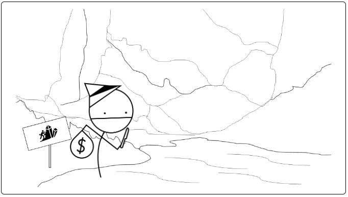
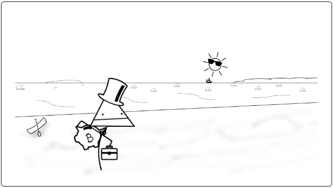

<h1 style="
text-align: Center; 
text-transform: uppercase; 
font-family: 'Courier New', Courier, monospace; 
letter-spacing: 3px;
font-weight: 700;
">
Qwetht
</h1>

### [AMIRESPONSIVE IMG TO GO HERE]

<h2 style="
text-align: center;
font-family: 'Courier New', Courier, monospace;
">
The Adventure generator beyond your wildest dreams, if your wildest dreams were created in MS paint.
</h2>

 

# Table of Contents
1. [INTRODUCTION](#introduction)
 

2. [UX](#ux)
   - Stakeholder Interview
   - Competitor Review
   - Target Demographics
   - User Goals
   - Business Interview
   - Development Planes
     - Strategy
     - Scope
     - Structure
     - Skeleton
       

3. [DESIGN](#design)
   - Colors
   - Typography
   - Imagery
     

4. [FEATURES](#features)
   - Design Features
   - Index Page
   - About Page
   - Portfolio page
   - FAQ Page
   - Contact Page
   - 404 Page
   - 500 Page
   - Features to Implement in Future
    

 5. [BUGS](#bugs)
   - Resolved Bugs
   - Unresolved Bugs
  

 6. [TECHNOLOGIES](#technologies)
    - Languages Used
    - Frameworks
    - Libraries
    - Programs
  

6. [TESTING](testing.md)
  - Contained as a seperate document [here](testing.md)
     

7. [DEPLOYMENT](#deployment)
    - Step-by-step guide on how to deploy
   

8. [CREDITS](#credits)
 

9. [ACKNOWLEDGEMENTS](#acknowledgements)
 

# Introduction

Qwetht is a randomly generated adventure game inspired by classic text-based Adventure games like [Colossal Cave Adventure](https://en.wikipedia.org/wiki/Colossal_Cave_Adventure), webcomics such as [Problem Sleuth](http://www.mspaintadventures.com/newindex.php?viewmap=4) by [MS Paint Adventures](http://www.mspaintadventures.com/newindex.php) and tabletop games such as [Munchkin](https://en.wikipedia.org/wiki/Munchkin_(card_game)). The Game allows a player to pick one of three classes:

| 
The Knight
 | 
The Thief
 | 
The Merchant
 |
| ---------- | --------- | ------------ |
|  |  |  |

Once the player chooses their class, they will then have a random character generated for them, in addition to an adventure, where they will be take on 10 random encounters in order to complete the game.
 
Much like the games it was inspired by, 
Qwetht is very much designed to be that of a [roguelike](https://en.wikipedia.org/wiki/Roguelike) game, where incorrect decisions or bad luck result in game over, and there is heavy emphasis on starting over fresh each time the game is played.

## This project is the second of the five projects to be created for the Diploma in Full Stack Software Development (Common Curriculum).

Project purpose: Presentation of interactive data

The aim of this project is to:
 - Build an interactive front-end website
 - The site in question should respond to user's actions, allowing users to interact with data
 - alter the way the site displays information to achieve a preferred user goal
 - The site should make use of HTML, CSS and Javascript to achieve the above aims

 

# User Experience (UX)

## Research

As Mentioned in the [Introduction](#introduction), the game is inspired by original text-based adventure games, table-top games, roguelike games and webcomics. styling inspiration and mechanic ideas where derived from viewing the following sources:
1. [MS Paint Adventures](http://www.mspaintadventures.com/newindex.php?viewpage=archive)
    - As this site is now pretty old, it appears the site archive has not been maintained. However, when this comic series was active, the author would create the next pane of each comic solely from the input provided by fans and its community. This resulted in an element of chaos and randomness which made the comic humorous and enjoyable.
    - with these elements in mind, peers were contacted for limitied input regarding encounters with no context, names, monsters and other aspects of the end product that are rendomly generated, to try and emulate a similar sense of chaos and randomness in this game.
    - Style for the project was inspired by the original design of these webcomics.

     

2. [Colossal Cave Adventure](https://www.microsoft.com/en-gb/p/colossal-cave-adventure/9wzdncrdlv4h?activetab=pivot:overviewtab)
    - The original test based game that proceduraly generates an adventure, offering users text to determine outcomes of scenarios.
    - This mechanic is adopted with the use of the information collected by peers to create the concept of a randomly generated adventure.

     

3. [Dark Souls](https://en.wikipedia.org/wiki/Dark_Souls)
    - This video game employs the use of player death as a direct mechanic of the core gameplay loop.
    - This idea was adopted for use within this game, given the game's small nature, and the limited timeframe to build. the routine death mechanic ensures for regular cycling of player type and encounter type.

     

4. [Munchkin](https://en.wikipedia.org/wiki/Munchkin_(card_game))
    - The aim of the game in Munchkin is for players to reach level 10 by "kicking in the door" on each turn as if they are progressig through a dungeon. the game employs simple math to determine if players succeed in an encounter, and if they do, gain and increased stat each level they complete.
    - The game also employs elements that encourage other players to either work together or sabotage each other to prevent victory.
    - Both of these concepts were utilised within the project. With the Idea that players must complete a journey (consisting of 10 stages, progress being represented in percentage) with a reward of an increase in player stats upon successful engagement in the randomly generated encounter. The game also employs a "run away" mechanic should a player not like their odds when presented with a given encounter, but can still be punished during the run away roll, much like the conflict that is presented when playing Munchkin.

     

5. [Dungeons & Dragons 5E](https://en.wikipedia.org/wiki/Dungeons_%26_Dragons) 
    - This table top game uses varying types of dice rolls to determine the outcome of adventures tailored to the players. 
    - "Dice rolls" were employed as the base mechanics in this project to determine encounters, names, monesters and so forth. As well as performing stat checks, similar tot he way they are carried out in a standard game of Dungeons & Dragons.

 

## Development Planes

## <b>Strategy Plane</b>

## User Stories

### <b>First-time Players</b>
Play-testers were interviewed before playing the game to establish user stories:

1. <em>"As a first-time player, i want to be able to understand the game mechanics with little study. The game UI needs to be intuitive."</em>
2. <em>"As a first-time player, i want there to be a help or menu section that explains the finer intricacies of the game, with little-to-no redirection from the game."</em>
3. <em>"As a first-time player, i want to have the element of choice when starting a game."</em>
4. <em>"As a first time player, i want the game interface to be clear and consistent at each step of the core gameplay loop."</em>
5. <em>"As a first-time player, i want to be able to track my progress during a playthrough."</em>

### <b>Returning Players</b>
After Playtesting the game, players were interviewed to establish their user stories as users who had played the game previously:

1. <em>"As a returning player, I want to be able to pick up where i left off."</em>
2. <em>"As a returning player, I want to be able to see a record of my past completions."</em>

 

## Project Goals

The project goal is to create a simple adventure game that draws from text-based and procedural adventure games that provides light humour and a challenge balanced equally by luck and choice.

 

  ### <b>Player goals</b>
  Based on user stories, user goals are defined as:

   1. A simple and easy to follow game
   2. A game that strikes a balance between choice and luck
   3. A game that can track and acknowledge the achievements of players
   4. A game that easy to "pick up" and "put down" as appropriate for a user

  ### <b>Developer Goals</b>   
  Based on project research, project goals are defined as:

   1. Create a random and humerous adventure game
   2. Create a game that adopts roguelike concepts, treating player death as part of the integral gameplay loop
   3. Create a game that effectively functions as a mini solo-play table-top RPG

 

## <b>Scope Plane</b>

Based on the results of the strategy plane the following features have been focused on to develop:
 1. Player jobs/classes
    - at the start of the game, the player will be given the choice of 3 classes, each leaning more favourably into one of the 3 stats used for the game.

     

 2. Text that generates per each choice and action taken by the user
    - The text will be the first element to be read after the page title, being a focal point of information for the user.
    - This same text field will update every time a user takes an action, prompting them of the outcome of their choices.

     

 3. A box or viewport that gives visual representation of the adventure
    - The box will be placed directly under the text, to give visualisation of the narrative generated.
    - It will contain a backdrop and also an image representative of the player character.
    - image representing player character will be different based on the class picked by the player.

     

 4. An element that highlights player progress
    - a progress bar or counter will be places under all the main game controls, which tracks the players progress/how many encounters they have completed.

     

 5. Viewable and upgradable player stats
    - player stats will display next or under the visualisation window, depending on viewport/device parameters.
    - the stats will upgrade automatically depending on successful choices made by the user.

      

 6. A Prompt that appears upon player death
    - This will mimic the style of the death message that appears when players would die in the game [Dark Souls](https://www.youtube.com/watch?v=-ZGlaAxB7nI).

     

 7. A prompt that appears upon completing the game
    - Adopt a similar style to the message that appears in Dark souls [when a player defeats a boss or lights a bonfire](https://youtube.com/shorts/CzY3jsotryg?feature=share) in order to keep in line with the game style.

     

 8. Options to take per encounter
    - Have clear buttons that outline player options that appear right below the encounter visualisation.

     

 9. a "new Game" button
    - Will appear when a user completes a game or dies, allowing more a more seamless replay and user experience. 

 

## <b>Structure Plane</b>
Given the simplistic nature of the game; and for it to be seemless, all elements will be housed on the one page.

 

## <b>Skeleton Plane</b>
Using the information this far, Wireframes were created using Balsamiq. Mock ups were created for both a mobile design and landscape design

from left to right (reading like a storyboard), each image displays the following:
 1. The view of the page upon initial loading
 2. After the player has clicked to begin
 3. Afer the player has selected their class and received their prologue
 4. When a player is met with an encounter
 5. View upon encounter success
 6. View on encounter failure
    
    a. Same style will be used when user completes game. but text will be altered to reflect completion

<h3 syle="text-align: center">Landscape/desktop view</h3>

 

<h3 syle="text-align: center">Portrait/mobile view</h3>

 

# design 

## Colour Scheme

[Coolors](https://coolors.co/) was used to render the sample palette for the project. However, given the nature of the project, colours were very straightforward to discern. Black and white for the general aesthetic of the site was ideal, follow the ideal of the game being simplistic and low-fidelity in nature. Red and Orange colours were kept as simple as possible t try and stay in line with this style ethos. These brighter colours are to be used when a player gets a game over of completes the game.

## Typography

To continue with the project's "classic" text-based game origin, classical serif and monospace fonts were deliberately selected as they actively reflect the projects inspiration and reductive style.

All main text is written in styles/decorations of the Courier New / Courier / Monospace font family.

The outcome box, AKA, the "You died" notification, follows the style form the source is was inspired from, as such, it adopts the use of the Times New Roman / Times / Serif Font family.

 

## Imagery

All imagery for the project was created in Microsoft PowerPoint. This was done deliberately to maintain a <em>doodle-like</em> design, but better that my actual doodles. because i can't draw.

High res images were taken from google and then traced over or replaced with rudimentary shapes on microsoft powerpoint. the super imposed drawing was then lifted and converted to an image to give a doodle like feel, but because of the tracing, background environments are more discernable as oppoesed to drawing them from nothing.

The page design allows for the users choices to essentially create the hero image of the page. Offering a very minor degree of personalisation/immersion - given the style of the game.

||||
| ------ | ------ | ------ |

The site does not employ any other imagery, given that it is derived from a text-based idea.

Buttons and interactive elements on the page follow suit with the monochrome/monospace design, but still have hoverable and active elements to give the user appropriate feedback to ensure they are using controls correctly. more of this will be covered in the next section

## Features

### Design Features

Visual features

loading screen

- When a user visits the page, while the page is loading they will only see a white screen with "loading...".
- this dissapears once all javascript has been loaded.
- this prevents any players with slower connections from playing with partially read code, preventing any errors that could be caused by this

introductory text

- When the game is first loaded, this text gives a general welcome to the game. It tells the visitor that the site is a game and what kind of game it is
- when a game is started - once a use has picked a job, a random name, destination and reason for adventure are generated. they are then insterted into a string of text to make sense of the information, and this then replaces the initial introductory text
- has a white background with white dispered shadow border so that the rotating background image does not obstruct text 

Backgrounds

- Opening page: There is an animated hero image, showing some of the basic cartoon design elements in the game. the background rotates on an infinite 20-second loop. giving a small amount of interaction, without being too overbaring in comparison to the minimalistic style. This feature helps give more context to the initial introduction text.

- Game backgrounds: upon starting the adventure, or moving to the next encounter. The background in the story box cycles randomly to give a different background each encounter. backgrounds are also animated to slide in from the right to imply movement into another area.

Character

- Character Icon: the character model that players can see depends on what job they pick. 
  - The icon will also move across a small percentage of the window upon each encounter beaten.
  - The icon has an animation where it will "fall over" if a player fails an encoutner and dies.
  - The icon does continous backflips on a loop if the player completed the game.

stats

- there are 3 stats:
  - Strength
  - Agility
  - Cunning
- Each job has a unique allocation of points for each stat from a total of 12 points
- when a job is selected, the stats and their values slide up from the bottom of the screen in a cascading fashion
- These stats are used to determine wether each encounter is successful or not
- when a player is successful in an encounter, the stat that was used to check if they succeeded increases by 1

Encounter text

- whenever an encounter is generated, a string of text with a randomly generated name and monster/npc type is printed above the story box
- If a user succeds in an encounter, a victory message replaces the text here, it also prompts the user to et them know the certain stat that was checked against is raised by 1
- the information will then cycle upon further progression

Death/Victory box

- Upon death, a shadowed opaque box appears with red shadowed text telling the user that they DIED
- This box will also contain a unique death message depending on the encounter type, monster type, and monster name
- If the user completes the game, this box changes to orange with yellow shadowed text, with a completion message tailored to their chosen job, destination and reason for advanture

buttons

- Features applied to all buttons:
  - Button buttons are styled black with shite writing to contrast with the mainly white with black text design of the page
  - when hovered over, button text turns bold, the color changes black and the background colour changes white
    - the mouse cursor also changes to "pointer"
  - When clicked, the padding in the button reduces by 1 pixel and a box shadow is employed, to simulate the button being clicked-down-on
- job choosing buttons
  - animated to drop down into view when page loads
  - vanishes once a player picks a class
  - only appear when at the starting phase of the game
- action buttons
  - Do it! buttons and Run away! buttons
    - appears once an encounter is generated
    - shares the same appearance animation to the job buttons when they become visible
    - dissapears when clicked
    - triggers javascript functions to progress game (more on that in the next subsection below)
- Let's go! and Keep going! buttons
  - appears once a player has selected a job or successfully passed or ran from an encounter
  - is actually the same button, but the text changes to Keep going! after first use
- new game button
  - appears when a user either dies or completes the game
  - when clicked, it reloads the page and triggers the loading screen to come up while the page is unloading.

Modal box with instructions

- has it's own seperate button in the footer
  - has the same style as regular page buttons but all colours are inverted as it sits on a black background
  - when the button is active (on mouse down) the button replaces its text with another randum "uction" word
  - when clicked, a modal window appears over the top of the game
    - it consists of an outer box, which acts as an opaque backdrop
    - and an inner box with a white background, displaying instructions text
  - any time a button is mentioned in the instructions, the style is changed with a span so that it looks like
   the button it represents in game
  - the same styling rhetoric is applied to any time the word "die" is mentioned. to match the styling of the death message

bugs:
modal box button not clickable on touchscreens
404/500 doing immediate redirect
"keep going" button not triggering with animation

