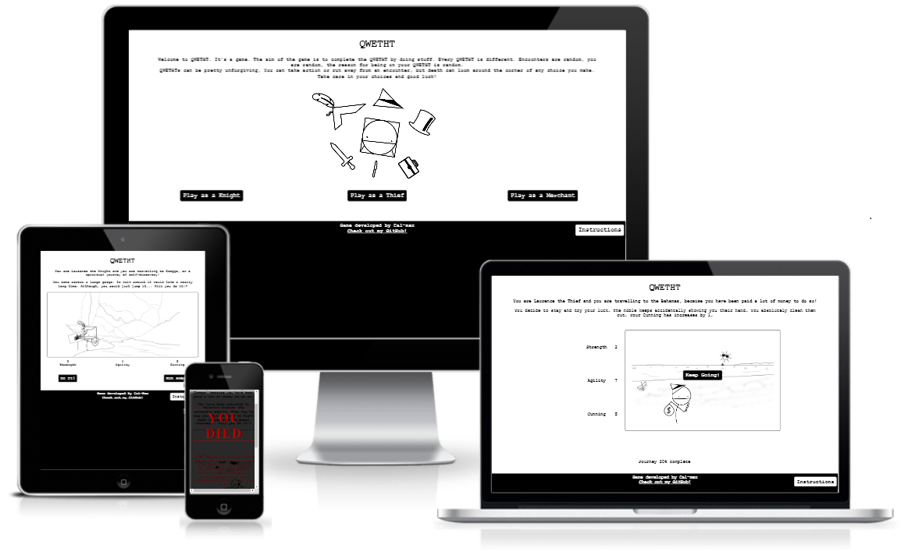
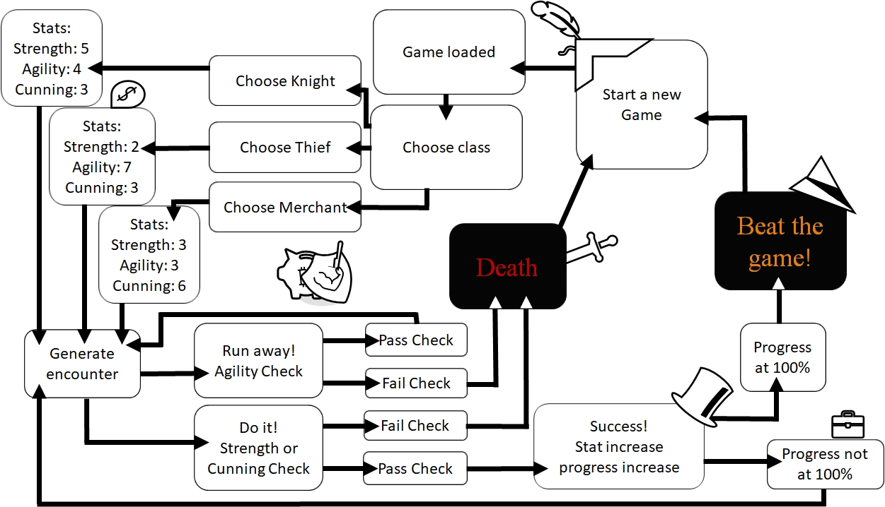

# QWETHT

### The adventure game that goes beyond your wildest dreams. If your dreams were relatively unimaginative

---

## Table of Contents
1. [INTRODUCTION](#introduction)
2. [DESIGN](#design)
- [UX](#ux)
  - [Research](#research)
- [Development Planes](#development-planes)
  - [Strategy](#strategy)
  - [Scope](#scope)
  - [Structure](#structure) 
  - [Skeleton](#skeleton)
- [Colour Scheme](#colour-scheme)
- [Typography](#typography)
- [Imagery](#imagery)

3. [FEATURES](#features)
- [Design Features](#design-features)
- [Visual Features](#visual-features)
- [Gameplay + JS Features](#gameplay-features)
- [404 and 500 Features](#404-and-500-error-pages)
- [Features to Implement in Future](#features-to-implement-in-future)

4. [BUGS](#bugs)
- [Resolved Bugs](#resolved-bugs)
- [Unresolved Bugs](#unresolved-bugs)

5. [TECHNOLOGIES](#technologies)
- [Languages Used](#languages-used)
- [Frameworks](#frameworks--libraries--programs)
- [Libraries](#frameworks--libraries--programs)
- [Programs](#frameworks--libraries--programs)

6. [TESTING](testing.md)

Contained as a seperate document [here](testing.md)

7. [DEPLOYMENT](#deployment)

Step-by-step guide on how to deploy

8. [CREDITS](#credits)

9. [ACKNOWLEDGEMENTS](#acknolwedgments)

---

## Introduction

**QWETHT** is a randomly generated adventure game inspired by classic text-based Adventure games like [Colossal Cave Adventure](https://en.wikipedia.org/wiki/Colossal_Cave_Adventure), webcomics such as [Problem Sleuth](http://www.mspaintadventures.com/newindex.php?viewmap=4) by [MS Paint Adventures](http://www.mspaintadventures.com/newindex.php) and tabletop games such as [Munchkin](https://en.wikipedia.org/wiki/Munchkin_(card_game)). The Game allows a player to pick one of three classes:

| The Knight| The Thief | The Merchant |
| ---------- | --------- | ------------ |
|  |  |  |

Once the player chooses their class, they will then have a random character generated for them, in addition to an adventure, where they will take on 10 random encounters in order to complete the game.

Much like the games it was inspired by, **QWETHT** is very much designed to be that of a [roguelike](https://en.wikipedia.org/wiki/Roguelike) game. Incorrect decisions or bad luck results in game over, and there is heavy emphasis on starting over fresh each time the game is played.

**This project is the second of the five projects to be created for the Diploma in Full Stack Software Development (Common Curriculum)**

Project purpose: Presentation of interactive data.

The aim of this project is to:
 - Build an interactive front-end website.
 - The site in question should respond to user's actions, allowing users to interact with data.
 - Alter the way the site displays information to achieve a preferred user goal.
 - The site should make use of HTML, CSS and Javascript to achieve the above aims.

---

## Design

### UX

#### Research
As Mentioned in the [Introduction](#introduction), the game is inspired by original text-based adventure games, table-top games, roguelike games and webcomics. styling inspiration and mechanic ideas where derived from viewing the following sources:
1. **[MS Paint Adventures](http://www.mspaintadventures.com/newindex.php?viewpage=archive)**
 - As this site is now pretty old, it appears the site archive has not been maintained. However, when this comic series was active, the author would create the next pane of each comic solely from the input provided by fans and its community. This resulted in an element of chaos and randomness which made the comic humorous and enjoyable.
 - with these elements in mind, when planning **QWETHT**, peers were contacted for limited input regarding encounters with no context. Names, monsters and other aspects of the end product that are randomly generated were created from this input to try and emulate a similar sense of chaos and randomness in **QWETHT**.
 - Style for the project was inspired by the original design of these webcomics.

2. **[Colossal Cave Adventure](https://www.microsoft.com/en-gb/p/colossal-cave-adventure/9wzdncrdlv4h?activetab=pivot:overviewtab)**
 - The original test based game that proceduraly generates an adventure, offering users text to determine outcomes of scenarios.
 - This mechanic is adopted with the use of the information collected by peers to create the concept of a randomly generated adventure.

3. **[Dark Souls](https://en.wikipedia.org/wiki/Dark_Souls)**
 - This video game employs the use of player death as a direct mechanic of the core gameplay loop.
 - This idea was adopted for use within this game. Given the game's small nature; and the limited timeframe to build, the routine death mechanic ensures for regular cycling of player type and encounter type.

4. **[Munchkin](https://en.wikipedia.org/wiki/Munchkin_(card_game))**
 - The aim of the game in Munchkin is for players to reach level 10 by "kicking in the door" on each turn as if they are progressing through a dungeon. The game employs simple math to determine if players succeed in an encounter, and if they do, gain and increased stat each level they complete.
 - The game also employs elements that encourage other players to either work together or sabotage each other to prevent victory.
 - Both of these concepts were utilised within the project. With the Idea that players must complete a journey (consisting of 10 stages, progress being represented in percentage) with a reward of an increase in player stats upon successful engagement in the randomly generated encounter. The game also employs a "run away" mechanic should a player not like their odds when presented with a given encounter, but can still be punished during the run away roll, much like the conflict that is presented when playing Munchkin.

5. **[Dungeons & Dragons 5E](https://en.wikipedia.org/wiki/Dungeons_%26_Dragons)** 
 - This table-top game uses varying types of dice rolls to determine the outcome of adventures tailored to the players. 
 - "Dice rolls" were employed as the base mechanics in this project to determine encounters, names, monesters and so forth.
 - Stat checks are also emplyed in the game, similar to the way they are carried out in a standard game of Dungeons & Dragons.

 

### Development Planes

#### **Strategy**

##### ***User Stories:***

 

###### First-time Players:
Play-testers were interviewed before playing the game to establish user stories:
- _"As a first-time player, i want to be able to understand the game mechanics with little study. The game UI needs to be intuitive."_
- _"As a first-time player, i want there to be a help or menu section that explains the finer intricacies of the game, with little-to-no redirection from the game."_
- _"As a first-time player, i want to have the element of choice when starting a game."_
- _"As a first time player, i want the game interface to be clear and consistent at each step of the core gameplay loop."_
- _"As a first-time player, i want to be able to track my progress during a playthrough."_ 

###### Returning Players:

 

A bare-bones text-only version of the game was created and then distributed to Playtesters. After playing, players were interviewed to establish their user stories as users who had played the game previously:

- _"As a returning player, I want some options that would allow further augmentation of encounter chances"_
- _"As a returning player, I want to be able to pick up where i left off."_
- _"As a returning player, I want to see fresh encounters when i play the game."_

##### ___Project Goals:___
The primary project goal is to create a simple adventure game that draws from text-based and procedural adventure games that provides light humour and a challenge balanced equally by luck and choice.

##### Player goals:

Based on user stories, user goals are defined as:

- A simple and easy to follow game.
- A game that strikes a balance between choice and luck.
- A game that can track and acknowledge the achievements of players.
- A game that easy to "pick up" and "put down" as appropriate for a user.

##### Developer Goals:
  Based on project research, project goals are defined as:

- Create a random and humerous adventure game.
- Create a game that adopts roguelike concepts, treating player death as part of the integral gameplay loop.
- Create a game that effectively functions as a mini solo-play table-top RPG.

#### **Scope**

Based on the results of the strategy plane the following features have been focused on to develop:
 1. **Player jobs/classes**
  - At the start of the game, the player will be given the choice of 3 classes, each leaning more favourably into one of the 3 stats used for the game.

 2. **Text that generates for each choice and action taken by the user**
  - The text will be the first element to be read after the page title, being a focal point of information for the user.
  - This same text field will update every time a user takes an action, prompting them of the outcome of their choices.

 3. **A box or viewport that gives visual representation of the adventure**
  - The box will be placed directly under the text, to give visualisation of the narrative generated.
  - It will contain a backdrop and also an image representative of the player character.
  - image representing player character will be different based on the class picked by the player.

 4. **An element that highlights player progress**
  - A progress bar or counter will be placed under all the main game controls, which tracks the players progress/how many encounters they have completed.

 5. **Viewable and upgradable player stats**
  - Player stats will display next or under the visualisation window, depending on viewport/device parameters.
  - the stats will upgrade automatically depending on successful choices made by the user.

 6. **A Prompt that appears upon player death**
  - This will mimic the style of the death message that appears when players would die in the game [Dark Souls](https://www.youtube.com/watch?v=-ZGlaAxB7nI).

 7. **A prompt that appears upon completing the game**
  - Adopt a similar style to the message that appears in Dark souls [when a player defeats a boss or lights a bonfire](https://youtube.com/shorts/CzY3jsotryg?feature=share) in order to keep in line with the game style.

 8. **Options to take per encounter**
  - Have clear buttons that outline player options that appear right below the encounter visualisation.

 9. **A "new Game" button**
  - Will appear when a user completes a game or dies, allowing more a more seamless replay and user experience. 

#### **Structure**
Given the simplistic nature of the game; all elements will be housed on the one page. Which will be made fluid and seemless by using Javascript.

#### **Skeleton**
Using the information gathered thus far, Wireframes were created using Balsamiq. Mock ups were created for both a mobile design and landscape design

from left to right (reading like a storyboard), each image displays the following:
1. The view of the page upon initial loading
2. After the player has clicked to begin
3. After the player has selected their class and received their prologue
4. When a player is met with an encounter
5. View upon encounter success
6. View on encounter failure
- Same style will be used when user completes game. But text will be altered to reflect completion

#### _Landscape/desktop view_

#### _Portrait/mobile view_

### Colour Scheme

[Coolors](https://coolors.co/) was used to render the sample palette for the project. 

However, given the nature of the project, colours were very easy to decide upon. 
- Black and white for the general aesthetic of the site was the ideal choice. 
- Following the concept of the game being simplistic and low-fidelity in nature, Red and Orange colours were kept as simple as possible to try and stay in line with this style ethos. These brighter colours are to be used when a player gets a game over or completes the game.

### Typography
To continue with the project's "classic" text-based game origin, classical serif and monospace fonts were deliberately selected as they actively reflect the projects inspiration and reductive style.

All main text is written in styles/decorations of the Courier New / Courier / Monospace font family.

The outcome box, AKA, the "You died" notification, follows the style form the source is was inspired from, as such, it adopts the use of the Times New Roman / Times / Serif Font family.

### Imagery
All imagery for the project was created in Microsoft PowerPoint. This was done deliberately to maintain a _doodle-like_ design, but better that my actual doodles. because i can't draw.

High-res images were taken from google and then traced over or replaced with rudimentary shapes on Microsoft PowerPoint. The super-imposed drawing was then lifted and converted to an image to give a _doodle-like_ feel, but because of the tracing, background environments are more discernable as opposed to drawing them from nothing.

The page design allows for the user's choices to essentially create the hero image of the page. Offering a minor degree of personalisation/immersion - given the style of the game.

||||
| ------ | ------ | ------ |

The site does not employ any other imagery, given that it is derived from a text-based idea.

Buttons and interactive elements on the page follow suit with the monochrome/monospace design, but still have hoverable and active elements to give the user appropriate feedback to ensure they are using controls correctly. More of this will be covered in the next section

---

## Features

### Design Features

#### **Visual features**

#### _Loading screen_

- When a user visits the page, while the page is loading they will only see a white screen with "loading...".
- This dissapears once all javascript has been loaded.
- This prevents any players with slower connections from playing with partially read code, preventing any errors that could be caused by this.

#### _Introductory text_

- When the game is first loaded, this text gives a general welcome to the game. It tells the visitor that the site is a game and what kind of game it is.
- When a game is started; once a use has picked a job: A random name, destination and reason for adventure are generated. They are then insterted into a string of text to make sense of the information, and this then replaces the initial introductory text.
- Has a white background with white dispersed shadow border so that the rotating background image does not obstruct text. 

#### _Backgrounds_

- Opening page:
  - There is an animated hero image, showing some of the basic cartoon design elements in the game. The background rotates on an infinite 20-second loop, Giving a small amount of interaction, without being too zealous in comparison to the minimalistic style. This feature helps give more context to the initial introduction text.
- Game backgrounds:
  - Upon starting the adventure or moving to the next encounter, the background in the story box cycles randomly to give a different background each encounter. Backgrounds are also animated to slide in from the right to imply movement into another area.

#### _Character_

Character Icon: 
- The character model that players can see depends on what job they pick. 
- The icon will also move across a small percentage of the window upon each encounter beaten.
- The icon has an animation where it will "fall over" if a player fails an encoutner and dies.
- The icon does continous backflips on a loop if the player completes the game.

#### _Stats_

- There are **3** stats:
  - **Strength**
  - **Agility**
  - **Cunning**
- Each job has a unique allocation of points for each stat from a total of 12 points.
- When a job is selected, the stats and their values slide up from the bottom of the screen in a cascading fashion.
- These stats are used to determine wether each encounter is successful or not.
- When a player is successful in an encounter, the stat that was used to check if they succeeded increases by 1.

#### _Encounter text_

- Whenever an encounter is generated, a string of text with a randomly generated name and monster/npc type is printed above the story box.
- If a user succeds in an encounter, a victory message replaces the text here, it also prompts the user to let them know the certain stat that was checked against is raised by 1.
- The information will then cycle upon further progression.

#### _Death/Victory box_

- Upon death, a shadowed opaque box appears with red shadowed text telling the user that they _DIED_.
- This box will also contain a unique death message depending on the encounter type, monster type and monster name.
- If the user completes the game, this box changes to orange with yellow shadowed text, with a completion message tailored to their chosen job, destination and reason for advanture.

#### _Buttons_

Features applied to all buttons:
- Game buttons are styled black with white writing to contrast with the mainly white with black text design of the page.
- When hovered over, button text turns bold, the color changes black and the background colour changes white.
  - The mouse cursor also changes to "pointer".
  - When clicked, the padding in the button reduces by 1 pixel and a box shadow is employed, to simulate the button being clicked-down-on.

Job choosing buttons
  - Animated to drop down into view when page loads.
  - Vanishes once a player picks a class.
  - Only appear when at the starting phase of the game.

Action buttons
  - *Do it!* buttons and *Run away!* buttons.
    - Appear once an encounter is generated.
    - Shares the same appearance animation to the job buttons when they become visible.
    - Dissapear when clicked.
    - Trigger javascript functions to progress game (more on that in the next subsection below).
  - *Let's go!* and *Keep going!* buttons
    - Appears once a player has selected a job or successfully passed or ran from an encounter.
    - Is actually the same button, but the text changes to _"Keep going!"_ after first use.
  - New game button
    - Appears when a user either dies or completes the game.
    - When clicked, it reloads the page and triggers the loading screen to come up while the page is unloading.

#### _Modal box with instructions_

- Has it's own seperate button in the footer.
  - Has the same style as regular page buttons but all colours are inverted as it sits on a black background.
  - When the button is active (on mouse down) the button replaces its text with another randum "uction" word.
  - When clicked, a modal window appears over the top of the game.
    - It consists of an outer box, which acts as an opaque backdrop.
    - And an inner box with a white background, displaying instructions text.
  - Any time a button is mentioned in the instructions, the style is changed with a span so that it looks like the button it represents in game.
  - The same styling rhetoric is applied to any time the word "die" is mentioned. To match the styling of the death message

#### _footer_
- Houses a link to the author's GitHub and provides a space for the instructions button.
- The link to GitHub chnges to the red colour designated in the **Coolors** palette.

#### **Gameplay features**

#### _gameplay loop:_

1. Game Loaded:
When the page first loads, the grid that houses the structure of the game is targeted in the css with a style rule to remain `display: none;` . instead a `div` with "loading" is displayed. Once the JS has been fully loaded an event listener targets the loading screen and makes it no longer display, instead, the `grid` housing the game is now displayed.

2. Choose Class:
Now that the game is loaded, the `grid-area` that houses the storybox displays a hero image that is on a infinite rotation `animation` loop through use of a css class. The javascript targets the 3 following `button`s and makes them visible:
- Choose to play as a Knight: Strength 5, Agility 4, Cunning 3.
- Choose to play as a Thief: Strength 2, Agility 7, Cunning 3.
- Choose to play as a Merchant: Strength 3, Agility 3, Cunning 6.

Each button triggers a function in JS to allocate `string`s of stat values to allocated `div`s in the HTML. Then an avatar unique to that class is set to a smaller `div` inside the story box. This diplays the Players character over a randomly generated backdrop when the next step in the phase launches.

Now that there is a character model and stats, the JS creates 3 empty variables, then populates each one with a random integer between 0 and 5, essentially acting like rolling a 6 sided dice 3 times.
   - One variable is used for picking a character name from a pre-established `array` in the `function`.
   - The second picks a destination from a different `array`.
   - Lastly, the 3rd _"roll"_ determines a reason for the adventure to take place.

   These values are then printed in a template literal string into the div the introductory text was housed and replaces it.

   Another function is then triggered to remove the choose class buttons and instead display the game controls. The "let's go!" button is now visible too. 

3. Generate Encounter:
Now that the game has now been set up to play. the player can hit _"Lets go!"_ to begin.

Upon Clicking, a `function` will trigger to _"roll"_ 5 random numbers between 0 and 5 and `push` them into an `array`.
- The first 2 numbers in the `array` are added together, and allocated as the `value` of a variable that determines what random name should be selected for the monster/npc in the generated encounter if there is one.
- The the 3rd and 4th `array` `value`s are allocated to a second variable which is used to determine what type of monster/npc will be in the encounter.
- the last `value` in the `array` is used to determine what encounter is _"rolled"_.
  - There is also a `function` that checks the `value` of this `array` number. If it is the same as the last encounter, it _"re-rolls"_ the number until it is a different `value`. This prevents getting the same encounter back-to-back.

Players can now decide to do one of the following:
- _Run away!_
  - A global variable called _RunRoll_ is declared as "`true`"
  - Another number is rolled in the JS. This new value is compared to the player's **Agility** stat.
  - If the number is less than or equal to the player's **agility** stat, it is regarded as a success.
  - If the rolled number is greater than the player's **agility** stat, it is deemed a failure.
       
- _Do it!_
  - Another number is rolled in the JS. This new `value` is compared to the player's **Strength** or **Cunning** stat depending on what type of encounter was generated (**Agility** can also be checked, but there are no scenarios that target it for this action).
  - If the number is lesser than the players Allocated stat, the action is regarded as a success.
  - If the number is greater than or equal to the player's allocated stat, the action is regarded as a failure.

4. Fail check

Failing _Run away!_ roll:
- The game buttons are removed from view, along with the _let's go!_ button. Instead, they are replaced with a large opaque box that tells the player they _"DIED"_.
- If the RunRoll variable is declared as `true`, it prints the death outcome for the scenario allocated to that encounter number if you fail the run away roll.
- A button appears under this box with the phrase "Start a new Qwetht!" which refreshes the page when clicked. This restarts the game. 
    
Failing a _Do it!_ roll:
- The game buttons are removed from view, along with the _Let's go_ button. Instead they are replaced with a large opaque box that tells the player they _"DIED"_.
- If the RunRoll variable is declared as `false`, it prints the death outcome for the scenario allocated to that encounter number if you fail the _"Do it!"_ roll.
- A button appears under this box with the phrase "Start a new Qwetht!" which refreshes the page when clicked. This restarts the game. 
       
5. Pass check

Succeeding a _Run away!_ roll: 
- If the check is regarded as a success, a `string` of text pertaining to that encounter is generated.
- The _"Do it!"_ and _"Run away!"_ `button`s are swapped out and replaced with the _"Let's go!"_ `button`, which has now had its text content changed to _"Keep Going!"_. This cycles the game back to generating a new encounter, but does not award progession.

Succeeding a _Do it!_ roll:
- If the check is regarded as a success, a `string` of text pertaining to that encounter is generated.
- The type of check used for the encounter is called, and increased incrementally by 1.
- The journey progression counter at the bottom of the screen is targeted and incrementally increased too (more on this in the next list item)
- The _"Do it!"_ and _"Run away!"_ `button`s are swapped out and replaced with the _"Let's go!"_ `button`, which has now had its text content changed to _"Keep Going!"_. This cycles the game back to generating a new encounter.

7. Increasing Progress
- As stated in the pass check section, any time an encounter is succeeded by a _"Do it!"_ roll, the game progess counter increases. The function that carries this out has an `IF` statement attached to it that if it reaches "10" a `function` will be triggered to launch the win game conditions
- `If` statements are also appended to the encounter generating function, which adjusts how high the number a check roll can generate.
  - If the the player's progress is less than or equal to 40%, the random number generated can be no higher than 4.
  - If the the player's progress is less than or equal to 70%, the random number generated can be no higher than 6.
  - If the the player's progress is greater than or equal to 80%, the random number generated can be up to 9.
  - This creates a sliding increase in difficulty, but still allows players a chance of progression without a high chance of outright murder at the start of the game.

8. Beating the game
- When game completion `function` is triggered. The death box `element`s are repurposed to display game winning text, the `color` is changed from red to orange with a yellow shadow.
- The box then displays the same way a deathbox would, but will contain unique text `string` depending on the player's randomly generated name, job, destination and reason for adventure.
    
#### **404 and 500 error pages**

Both pages share the same css style and design with the exception to minor changes to text content on the HTML - which displays the type of error, and a picture of one of the characters from the game.
 - In the 404, the thief character appears, looking as if he attempting to mug you with a butter knife.
 - For the 500, the merchant character is standing infront of what is supposed to look like an ominous doorway.

At the bottom of the image in each page there is a `button` that launches a function that returns users to the index.

#### **Features to Implement in Future**

This project was constrained mainly by a very short time budget. The following features were planned to be implemented, but instead, will be implemented in the future:

- Making use of `localStorage` object in Javascript to save a users game.
- Making use of `localStorgae` object in Javascript to keep a record of past completions.
- A higher variety of backgrounds and character models which would be randomly selected for each class.
- A higher variety of encounters.
- Sound effects:
  - A Sound that plays on death. Either similar to the [death noise in Dark Souls](https://www.youtube.com/watch?v=-ZGlaAxB7nI) or the [noise you make when you take damage in Minecraft](https://www.youtube.com/watch?v=0T_NR2KY8uI).
  - A sound effect for button clicks. Something light and not too invasive.
  - A sound that plays when an adventure is completed (some sort of incredibly dumb trumpet noise would be ideal).
- A more advanced death animation for the whole page. A telescopic zoom fade-in of the death box and the screen fading to black was an initial idea.
- A more advanced completion animation.
- Smoother class add/remove transitions from the background elements of the story box, instead of just having one slide in, the existing one should also slide out.

After hearing feedback from testers, the following features have been considered to be implemented in the future:

- Forking adventures, where certain decisions would shift the cycle and backgrounds of adventures entirely, depending on choices. For example: going out to sea and having sea-only encounters.
- Choosing your own character model.
- Completing certain encounters would give you items or options which could change the outcome of other encounters
  - Like an item that lets you skip one roll or specific encounter.
  - An extra life.
  - Temporary skill boosts.

Other back-of-house features:

- Changing how the JS stores information so that users cannot cheat by using dev tools to change their stat numbers.
- Partition the JS into more manageable sized code blocks. perhaps seperate certain `functions` where possible and create 3 JS scripts of roughly 200 lines of code each, as opposed to one big script file.
- The **Agility** Stat was originally referred to as "dexterity", but given the nature in which it is used in the game narrative it was changed to the former. Ideally, in the future the naming of variables and functions should be changed to reflect this.

---

## bugs

#### **Resolved Bugs:**
- 404 and 500 pages performing an immediate re-direct when loaded.
  - An error in the JS was found where the function that was the target of the buttons was not listed correctly.
- Progress counter being pushed behind the footer on certain encounters.
  - This was a sizing issue within the CSS, the `.game` `grid` has been adjust to not account for a section the viewport, which, while this allows for scrolling, allows for full view of all necessary content. 
- The Modal box button is bugged on touchscreens. users must click on the outside of the button multiple times for it to work.
  - Discovered [touch events](https://developer.mozilla.org/en-US/docs/Web/API/Touch_events?fbclid=IwAR2w2PfZG7e7IHm1pGNPlkc-Nz0eJEo1P6i27eAJ4_4DYdS0LLzCD4nHbSc) and implemented them to simulate the same functions as 'click' event listeners.
- The Modal box has an additional bug on touchscreens where it conflicts with the outer modal box `div`
  - This was partially resolved, the conflicting issue was negated by adding a `function` that adds a `class` to the modal box's `classList`. Making it cancel ignore `pointer-events`
  - This has partially obstructed full functionality of the modal, as clicking the outside of the box no longer triggers closing the modal box.
    - The closing _"X"_ at the top right of the modal has been enlarged significantly to try and compensate for this, as this element still works to close the modal box on touch screens
    - The modal box issues do not occur on devices using a mouse. 

#### **Unresolved Bugs:**
-  _"let's go!"_/_"Keep Going!"_ `button not` removing class animation.
   - Somehow the CSS that adds and removes `animation`s to `button`s is being added twice or more to this button. This is probably a case of sifting through the code and altering the line that is causing this. However, there was not enough time to search for this before the deadline.
  - `Button`s moving on `click` on the 404/500 pages.
    - While clicked on, the `button`s on the 404 and 500 pages jump. CSS needs to be altered to prevent this.

---

## Technologies

#### **Languages Used**

- **[HTML5](https://en.wikipedia.org/wiki/HTML5)**
- **[CSS3](https://en.wikipedia.org/wiki/CSS)**
- **[Javascript](https://en.wikipedia.org/wiki/JavaScript)**
- **[Markdown](https://en.wikipedia.org/wiki/Markdown)**

#### **Frameworks | Libraries | Programs**

**[GitHub](https://github.com/)**
- Used to store, deploy and publish site.

**[GitPod](https://gitpod.io/)**
- Used to write and preview code, commit and push to GitHub.

**[Google Chrome](https://www.google.co.uk/chrome)**
- Used developer tools to check site responsiveness, preview site outside of GitPod, preview and make minor tweaks in real time to code without messing up original code during development.

**[W3C Markup Validation Service](https://validator.w3.org/)**
- Used to validate and format code.

**[GIMP - GNU Image Manipulation Program](https://www.gimp.org/)**
- Used to convert images to .WEBP format.

**[MS Word](https://www.microsoft.com/en-us/microsoft-365/word)**
- Used to spellcheck and format text.

**[MS Paint3D](https://apps.microsoft.com/store/detail/paint/9PCFS5B6T72H?hl=en-us&gl=us)**
- Used to crop and consolidate imagery created in MS PowerPoint.

**[MS PowerPoint](https://www.microsoft.com/en-us/microsoft-365/powerpoint)**
- Used to make Imagery on site.

**[Balsamiq](https://balsamiq.com/)**
- Used to create site wireframes.

**[amiresponsive](https://ui.dev/amiresponsive)**
- Used to create Example image at top of the [readme.md](#contents).

**[Faviconer](http://faviconer.com/icon/index)**
- Used to create site favicon.

**[Opera](https://www.opera.com/)**
- Used to test UX.

**[Firefox](https://www.mozilla.org/en-GB/firefox/new/)**
- Used to test UX.

**[Microsoft Edge](https://www.microsoft.com/en-us/edge?form=MA13FJ)**
- Used to test UX.

**[Google Chrome on Android](https://support.google.com/chrome/answer/95346?hl=en&co=GENIE.Platform%3DAndroid)**
- Used to test UX.

**[Safari on Mac and iOS](https://www.apple.com/uk/safari/)**
- Used to test UX.

**[Python Tutor](https://pythontutor.com/)**
- Used to troubleshoot code steps + build code functions and visuaise their mechanics in an isolated environment.

**[ScreenRec](https://screenrec.com/)**
- Used to capture screen recordings of live site testing for [testing.md](testing.md).

**[Zoom](https://zoom.us/)
- Used to capture screen recordings of live site testing for [testing.md](testing.md).

**[Cloud Converter](https://cloudconvert.com/mp4-to-gif)**
- Used to convert screen captures into gifs to reduce file size in repo and [testing.md](testing.md).

**[Readme.so](https://readme.so/editor)**
- Used to help view and format readme in a side-by-side format and utilise organisational elements to cleanly compartmentalise information.

---

## Testing

[The testing section is appedned to a second document, click here to open.](testing.md)

---

## Deployment
This Site was created, developed, managed and stored on GitHub and GitPod.

The site is deployed on GitHub Pages, the following steps can be replicated to achieve the same result:
1. Sign up/create an account with GitHub (or log in with existing details).
2. Locate this repository (repo) by using the _search_ function.
3. Once clicked into the repo, click the settings cogwheel at the top right of the project.
4. Navigate to the pages section.
5. Navigate to source, select `main` from the dropdown menu to designate what branch to deploy.
6. Once this has been selected, the page will refresh, and the site will begin to deploy. This could take some time.
7. Once the page has been deployed you will be able to see it on the right-hand side of the main repo page.
8. You can click into the deployment page and then click "view deployment" to get the deployed link.

---

## Credits
#### **Troubleshooting sources**
- [Stack Overflow](https://stackoverflow.com/)
- [Bobby Hadz](https://bobbyhadz.com/blog/javascript-change-style-of-all-elements-with-class)
- [W3Schools](https://www.w3schools.com/js/default.asp)
- [MDN Web Docs](https://developer.mozilla.org/en-US/docs/Web/API/Touch_events?fbclid=IwAR2w2PfZG7e7IHm1pGNPlkc-Nz0eJEo1P6i27eAJ4_4DYdS0LLzCD4nHbSc)
- [Web.dev](https://web.dev/)
- Seun Owonikoko: Project Mentor

#### **Inspiration**
- [Colossal Cave Adventure](https://en.wikipedia.org/wiki/Colossal_Cave_Adventure)
- [Problem Sleuth](http://www.mspaintadventures.com/newindex.php?viewmap=4)
- [Munchkin](https://en.wikipedia.org/wiki/Munchkin_(card_game))
- [Dark Souls](https://en.wikipedia.org/wiki/Dark_Souls)
- [Dungeons & Dragons 5E](https://en.wikipedia.org/wiki/Dungeons_%26_Dragons)
- [BarfQuestion Comics](http://barfquestion.blogspot.com/2020/01/barfquestion-postmortem.html)

---

## Acknolwedgements
- Many thanks to every individual on slack who gave the game a go.
- Thank you to Roger Pfäffli, who helped tackle the Modal box bug.
- Thank you to Omercan Cirit, Christina Myrvold and Sarah Breen for their discussions on ideas.
- Thank you to Sarah Breen, Gemma Hammil and Matthew Franklin, who tested the site rigorously on iOS devices.
- Thank you to my partner for her patience with my obsessiveness over this project.
- Many thanks to My mentor Seun, for her guidance throughout this project.
